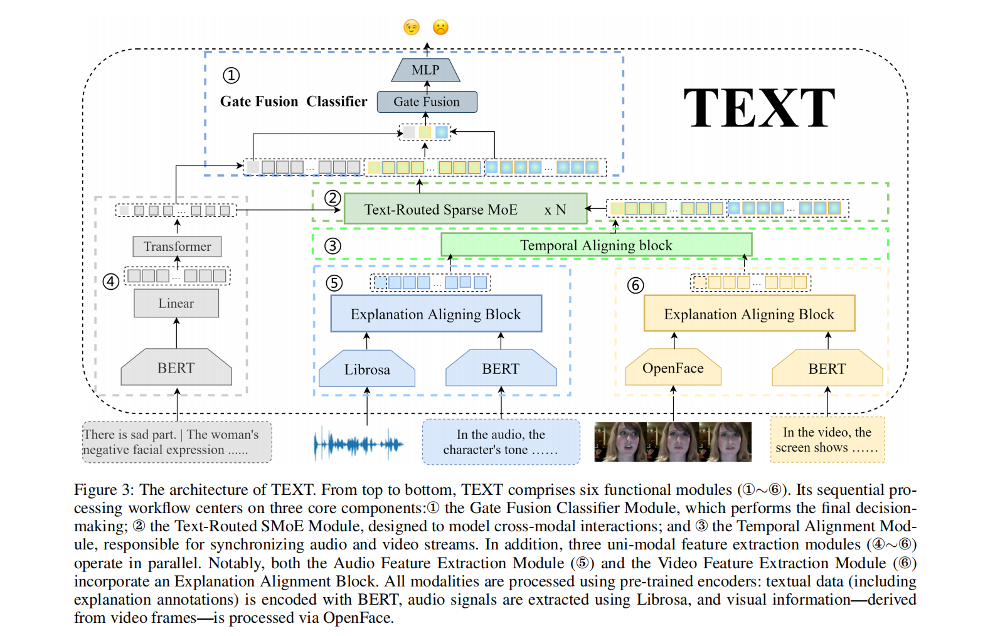

<div align="center">

# A Text-Routed Sparse Mixture-of-Experts Model with Explanation and Temporal Alignment for Multi-Modal Sentiment Analysis



</div>

*This repository contains the source code for the TEXT-main-1948 project, which is a part of the TEXT project focused on historical text analysis.*


## Table of Contents

- [Introduction](#introduction)
- [Installation](#installation)
- [Download Model](#download-model)
- [Download Datasets](#download-datasets)
- [Training](#training)
- [Testing](#testing)
- [Citation](#Citation)


## Introduction

The TEXT model (Experts model with eXplanation and Temporal alignment) is proposed for multi-modal sentiment analysis. It introduces several innovative components to enhance prediction accuracy and reduce deviation:

1. **Explanation Generation**: TEXT leverages multi-modal large language models (MLLMs), specifically VideoLLaMA 3, fine-tuned with the EMER-fine dataset, to generate explanations. These explanations are encoded using BERT for further processing.
2. **Cross-Modal Alignment**: To address potential misleading information from video or audio, TEXT aligns audio (using Librosa) and video (using OpenFace) encodings with the generated explanations via a Cross-Attention (CA)-based alignment module.
3. **Temporal Alignment**: A novel temporal alignment block is introduced to improve temporal fusion. This block simplifies and outperforms existing methods like Mamba and temporal CA.
4. **Sparse Mixture-of-Experts (SMoE)**: TEXT employs a text-routed SMoE mechanism to activate experts based on text dominance, ensuring better decision-making.
5. **Gate Fusion Classifier**: Finally, a multi-layer perceptron (MLP) with gate fusion (GF) is used as the classifier.

Experimental results demonstrate that TEXT significantly improves prediction accuracy. For instance, on the CH-SIMS dataset, TEXT reduces the mean absolute error (MAE) by 13.5% compared to previous models. Ablation studies further highlight the importance of the temporal alignment module in achieving these results.


## Installation  
To install the necessary dependencies for the TEXT-main-1948 project, you can use the following command:

```bash
conda create -n TEXT python=3.10.14
conda activate TEXT
pip install -r requirements.txt
```
**Note:** This project uses PyTorch 2.2.0 with CUDA 11.8 support (`torch==2.2.0+cu118`). Make sure your system has compatible CUDA drivers installed.


## Download Model
To download the `google-bert/bert-base-uncased` model from Hugging Face:

```bash
huggingface-cli download google-bert/bert-base-uncased --local-dir ./pretrained_model
```

## Download Datasets
MOSI/MOSEI/CH-SIMS original data: See [MMSA](https://github.com/thuiar/MMSA).  
our prepared data download link: https://pan.baidu.com/s/1EDam_w-0UMXhZKGykWKUFw?pwd=fn96

## Training
To run the training script:
```bash
python TEXT_train.py --device 0 --epochs 200 --text_bert text_residual_bert --note TEXT
```
note: To train on specific datasets, you can comment out the paths of the datasets you don't want to use in the dataPath dictionary within the TEXT_train.py script.  
And the results will be saved in the `./results.txt` file.

## Testing
Download checkpoint files: https://pan.baidu.com/s/12-XT0hJHXa4jeXmZUtjjGg?pwd=7chb

To run the testing script:
```bash
python TEXT_test.py --device 0 --text_bert text_residual_bert --note TEXT
```


## Citation  
If you find our work useful for your research, please cite our paper:  
title = {A Text-Routed Sparse Mixture-of-Experts Model with Explanation and Temporal Alignment for Multi-Modal Sentiment Analysis},
